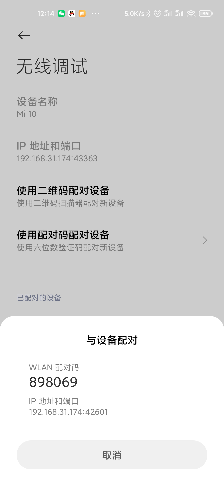

# Android 11 无线调试

[官方文档](https://developer.android.google.cn/about/versions/11/features#wireless-adb)

Android 11 支持通过 Android 调试桥 (adb) 从工作站以无线方式部署和调试应用。例如，您可以将可调试的应用部署到多台远程设备，而无需通过 USB 实际连接您的设备，从而避免常见的 USB 连接问题（例如驱动程序安装方面的问题）。

如需使用无线调试，您需要使用配对码将您的设备与工作站配对。您的工作站和设备必须连接到同一无线网络。如需连接到您的设备，请按以下步骤操作：

1. 在您的工作站上，更新到最新版本的 [SDK 平台工具](https://developer.android.google.cn/studio/releases/platform-tools)。
2. 在设备上启用[开发者选项](https://developer.android.google.cn/studio/debug/dev-options)。
3. 启用无线调试选项。
4. 在询问要在此网络上允许无线调试吗？的对话框中，点击允许。
5. 选择使用配对码配对设备。记下设备上显示的配对码、IP 地址和端口号（参见图片）。

    


6. 在工作站上，打开一个终端并导航到 `android_sdk/platform-tools`（或将此地址添加至环境变量）。
7. 运行 `adb pair ipaddr:port`。使用第 5 步中的 IP 地址和端口号。
8. 当系统提示时，输入您在第 5 步中获得的配对码。系统会显示一条消息，表明您的设备已成功配对。

    ```
    Enter pairing code: 898069
    Successfully paired to 192.168.31.174:42601 [guid=adb-25afe46f-6AOzFn]
    ```

9. （仅适用于 Linux 或 Microsoft Windows）运行 `adb connect ipaddr:port`。使用无线调试下的 IP 地址和端口。

    ```
    connected to 192.168.31.174:43363
    ```

10. 运行 `adb devices`，可以查看已连接的无线设备

    ```
    List of devices attached
    192.168.31.174:43363    device
    ```